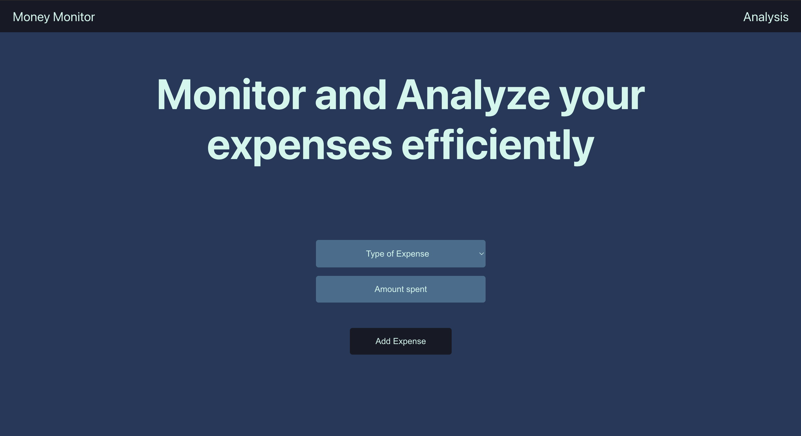
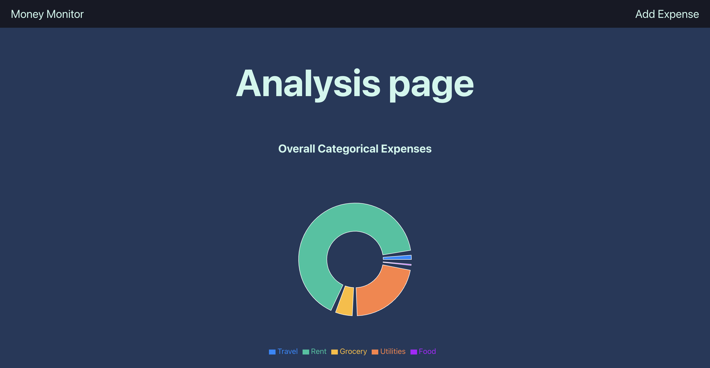
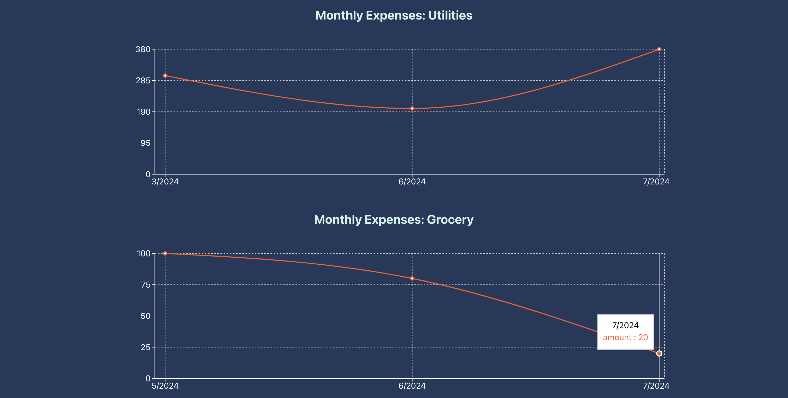

# Money Monitor

Money Monitor is a web application, that stores expenses and its category, in a NoSQL database, and creates graphs and illustrations to visualize and analyze your spending patterns.

Currently the graphs on the application are:

1. A Pie chart for categorical expenses. This includes all the expenses made from start date of entering expenses into the application.

2. Line charts for analyzing the monthly spending trends in each category.

Categories include:- Utilities, Grocery, Rent, Food and Travel.

The expense is not currency specific, i.e., there is no provision to choose amount spent in different currencies.

## Technologies used

- React.js
- Firebase
- 'Recharts' npm library

## Application

### Landing page view

### Analysis page view

## Future implementation ideas

- Adding a currency option as well to standardize the expenses made in other countries.

- Creating AI insights, to improve spending habits and avoid unnecessary expenses.

## Running the application

- Fork and then clone this repository using `git clone https://github.com/{YourUserName}/Money-Monitor.git`.

- cd into this repository and run `npm install`, which will install all the needed packages present in 'package.json' file.

- Next run `npm start` to run the application. It can be accessed at `localhost:3000`.

## Acknowledgments

- [React.js](https://react.dev/)
- [Recharts npm package](https://www.npmjs.com/package/recharts)
- [Firebase](https://firebase.google.com/)